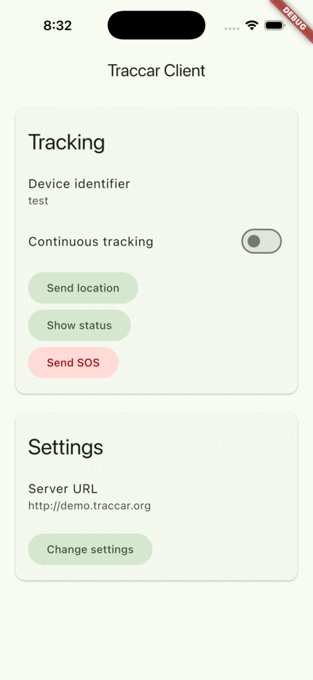

# [Traccar Client app](https://www.traccar.org/client)

[](https://play.google.com/store/apps/details?id=org.traccar.client) [](https://itunes.apple.com/app/traccar-client/id843156974)

## Overview

Traccar Client is a GPS tracking app for Android and iOS. It runs in the background and sends location updates to your own server running [Traccar](https://github.com/traccar/traccar), the open-source GPS tracking platform.

- **Real-time Tracking**: See your device’s location on your private server in real time.
- **Open-Source**: 100% free and open-source, with no ads or tracking.
- **Customizable**: Configure update intervals, accuracy, and data usage to fit your needs.
- **Privacy First**: Your location data is sent only to your chosen server—never to third parties.
- **Easy Integration**: Designed to work seamlessly with the Traccar server and many third-party GPS tracking platforms.

Just enter your server address, grant location permissions, and the app will automatically send periodic location reports in the background.

Don't have a Traccar server yet? [Try the live demo](https://www.traccar.org/demo-server/) or see the [installation guides](https://www.traccar.org/install-vps/) to set up your own for free.

| Client App |
|---|
|  |

## Build

Standard Flutter project:

```shell
flutter pub get
flutter run
```

## Team

- Anton Tananaev ([anton@traccar.org](mailto:anton@traccar.org))

## License

Apache License, Version 2.0. See [LICENSE.txt](https://github.com/traccar/traccar-client/blob/master/LICENSE.txt) for details.
